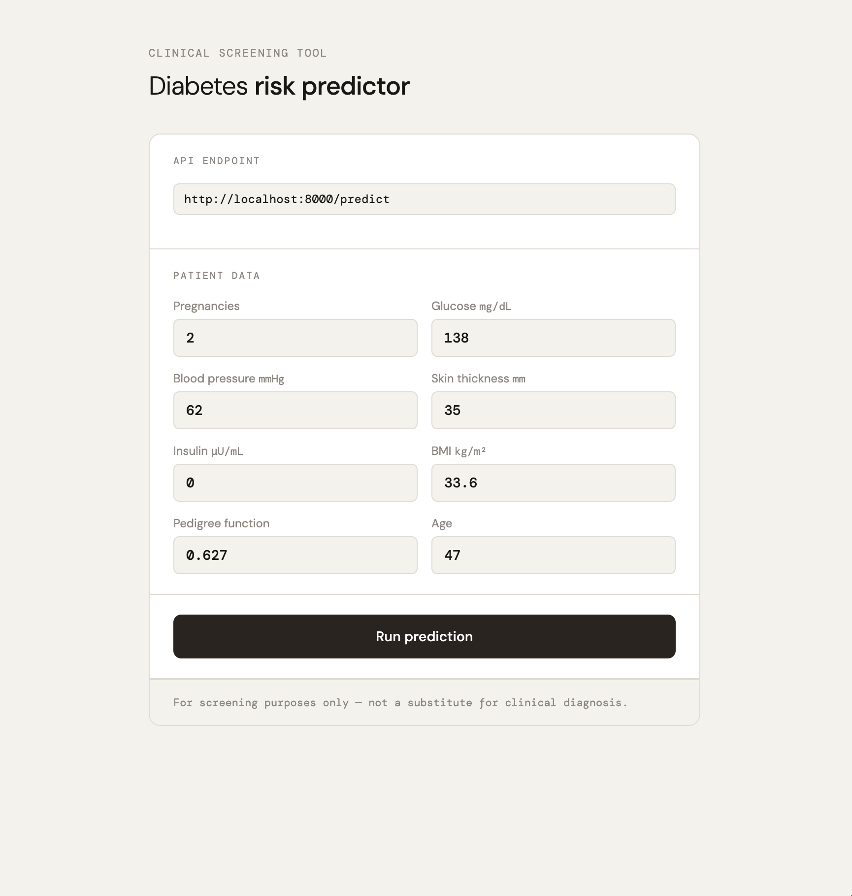
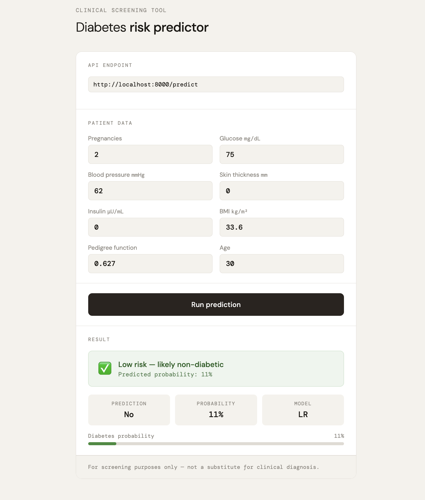

# Diabetes prediction

## Table of Contents
- [About](#about)
- [Installation](#installation)
- [Usage](#usage)
- [Authors](#authors)

## About <a name= "about"></a>

Diabetes prediction using a logistic regression model.

## Installation <a name= "installation"></a>

**Requirements** 
- Python 3.8+
- uv

**Clone the repo**

```
git clone https://github.com/paulinedao/ml-diabetes.git
```

**Project Structure**

```
├── pyproject.toml
├── uv.lock
├── README.md
├── app.py               # FastAPI backend
├── index.html           # Frontend
├── predict/
│   ├── model.pkl        # Trained logistic regression model
│   ├── imputer.pkl      # Median imputer for missing values
│   └── scaler.pkl       # RobustScaler for feature scaling
└── data/
    └── diabetes.csv     # Original dataset
```

### Setup environment

Recreate an environment:

```
uv sync
```

## Usage <a name= "usage"></a>

1. Start the API in terminal 1:
```
uv run uvicorn app:app --reload
```

2. Serve the frontend:

```
uv run python -m http.server 3000
``` 

3. Open the app

Go to this link in your browser:
```
http://localhost:3000
``` 

<p align="center">
  
</p>

<p align="center">
  
</p>

### Authors <a name= "authors"></a>
Pauline Dao
