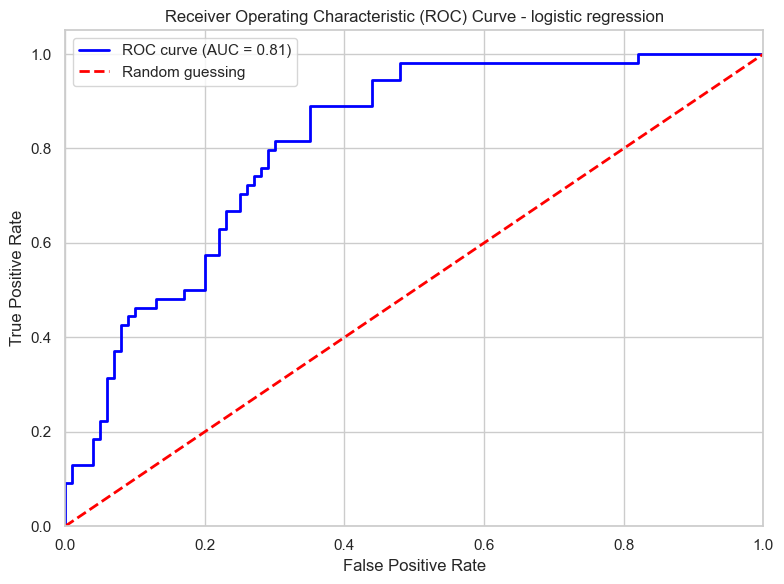

# Diabetes prediction

## Table of Contents
- [About](#about)
- [Installation](#installation)
- [Usage](#usage)
- [Authors](#authors)

## About <a name= "about"></a>

Diabetes prediction using a logistic regression model. Four models were trained and compared using a 5 fold cross validated F1 score on the training set. F1 was chosen as a scoring metric because the dataset is imbalance. 

Logistic regression was selected for its simplicity and given the dataset size (768 patients) compared to random forest, although Random Forest achieved a highest CV F1, it was not significantly. higher than the baseline model score. 

**Model comparison (CV F1 score)**
 
| Model | CV F1 |
|---|---|
| Random Forest | 0.706 |
| **Logistic Regression** | **0.668**|
| SVM | 0.636 |
| KNN | 0.603 |

The model was evaluated on a test set of 154 patients (20% of the dataset with stratified split).

| | Precision | Recall | F1 |
|---|---|---|---|
| Non-diabetic (0) | 0.82 | 0.75 | 0.79 |
| Diabetic (1) | 0.60 | 0.70 | 0.65 |
| **Weighted avg** | **0.75** | **0.73** | **0.74** |
 
- **Accuracy:** 0.73
- **ROC AUC:** 0.73

The recall for diabetic patients is 0.70 meaning that the model correctly identifies 70& of the diabetic and 30% are the false negative that the model misses.

**ROC curve**
 

 
AUC = 0.81, meaning the model has good discriminative ability between diabetic and non-diabetic patients across all classification thresholds.
 
**Data preprocessing**
 
- **Dataset:** Diabetes Dataset — 768 patients, 8 features
- **Class imbalance:** 65% non-diabetic / 35% diabetic
- **Hidden missing values:** zero values in Glucose, BloodPressure, SkinThickness, Insulin and BMI were treated as missing and imputed with the median
- **Feature scaling:** RobustScaler (median + IQR), chosen for its resistance to outliers, were present in several features
- **Hyperparameter tuning:** GridSearchCV over `C` {0.01, 0.1, 1, 10, 100} and penalty {L1, L2}

 **Limitations**
 
- Small dataset (768 patients) 
- The model misses ~30% of diabetic patients 
- For screening purposes only; always consult a medical professional

## Installation <a name= "installation"></a>

**Requirements** 
- Python 3.8+
- uv

**Clone the repo**

```
git clone https://github.com/paulinedao/ml-diabetes.git
```

**Project Structure**

```
├── .github/
│   └── workflows/
│       └── ci.yml
├── pyproject.toml
├── uv.lock
├── README.md
├── app.py               # FastAPI backend
├── test_app.py  
├── index.html           # Frontend
├── predict/
│   ├── model.pkl        # Trained logistic regression model
│   ├── imputer.pkl      # Median imputer for missing values
│   └── scaler.pkl       # RobustScaler for feature scaling
└── data/
    └── diabetes.csv     # Original dataset
```

### Setup environment

Recreate an environment:

```
uv sync
```

## Usage <a name= "usage"></a>

1. Start the API in terminal 1:
```
uv run uvicorn app:app --reload
```

2. Serve the frontend:

```
uv run python -m http.server 3000
``` 

3. Open the app

Go to this link in your browser:
```
http://localhost:3000
``` 

<p align="center">
  
</p>

<p align="center">
  
</p>

### Authors <a name= "authors"></a>
Pauline Dao
